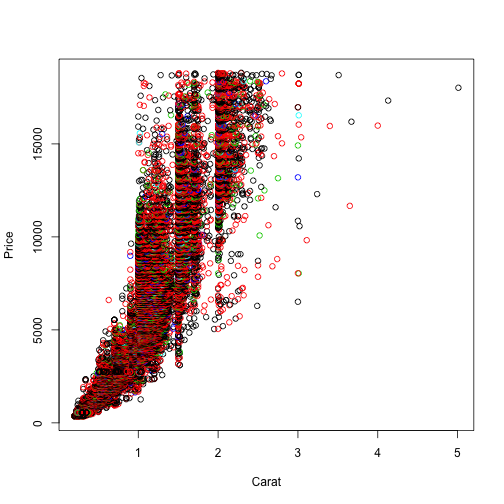

## What is Diamond Search Portal?

The **Diamond Search Portal** allows users to gain some insight at some 54,000 round-cut diamonds out there.

The portal allows you to search and analyze data for diamonds based on 4Cs and to compare prices and dimensions with just a few clicks. 

You don't have to trouble yourself with dealing with jewelers and diamond dealers, we have done to the leg work for you!

--- .class #id 

## Who should use Diamond Search Portal?

Are you a wholesale retailer, a to-be-spouse or just a diamond lover looking to find that perfect rock that matches your budget and your specifications? 

If yes,  then **Diamond Search Portal** is for you.

- You will be able to conduct your search based a number of criteria. 

- You will be able to visualize and analyze the data in numerous ways. 

- You will be able to download the data that you searched for as a .csv file.

------ &twocol w1:40% w2:60%

## Portal Interface - The two panels

*** {name: left}

Side Panel contains the following filters:  

- Price 
- Cut 
- Color 
- Clarity 
- Carat

*** {name: right}

Main Page is divided into the following tabs to allow you to efficiently obtain the information that you desire:  

- Table: Provides a listing of the data.         
- Summary: Provides a high-level summary of the data.     
- Plot: Allows you to create a scatter plot based on selected X- and Y-variables.                        
- Pie Chart: Beautifully displays information regarding Cut, Color and Clarity of the diamonds and their count.

--- &twocol w1:40% w2:60%

## Output Examples  

***{name: left}

<h3>Plot Example:</h3>

 

***{name: right}

<h3>Pie Chart Example:</h3>

<iframe src='
figure/chart1.html
' scrolling='no' seamless class='rChart 
highcharts
 '
id=iframe-
chartff664df1dfa
></iframe>

    
